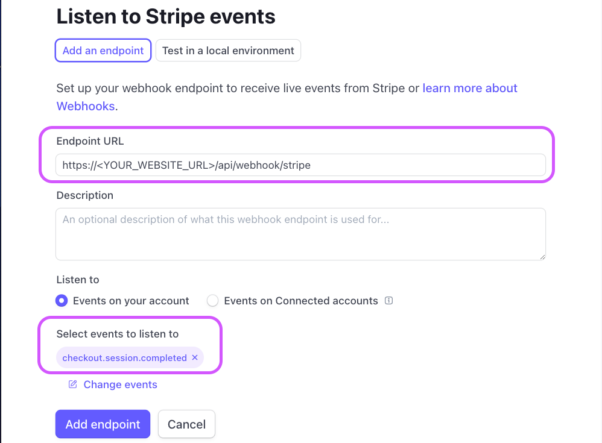
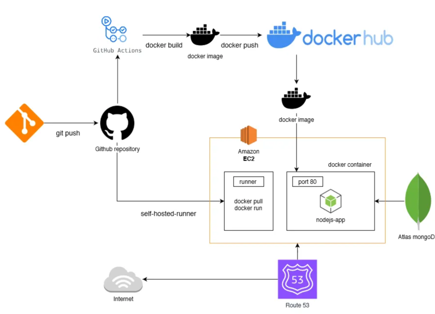
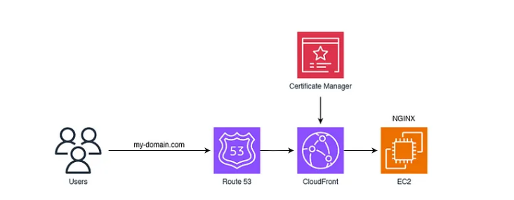

# Digital marketplace Techstacks:

- Fullstack approach, with combined BE and FE, with entry through ExpressJS
- Next14, Tailwind, [Shadcn UI](https://ui.shadcn.com/),[Lucide react](https://lucide.dev/icons/), [Zustand LocalStorage](https://docs.pmnd.rs/zustand/integrations/persisting-store-data)
- Backend: TRPC, Payload CMS, MongoDB
- Reference [Payload starting templates](https://github.com/payloadcms/payload/tree/main/templates)

## Getting Started

- Install Shadcn UI with `npx shadcn-ui@latest init`
- Choose the [color theme](https://ui.shadcn.com/themes) that you want to use, and copy the theme to `src/app/globals.css`

## Express Middleware for NextJs

- We are using [Express as a middleware](https://medium.com/@obulareddyveera/next-js-invite-express-js-as-middleware-ea5e7bb494f0) for interacting with Payload.
- Using `cross-env` and `nodemon` in `dev` mode will automatically restart the express server on file changes.
- We also need to add a few custom decorators in `tsconfig.server.json` to make Express works:

```tsconfig.server.json
{
  "extends": "./tsconfig.json",
  "compilerOptions": {
    "module": "CommonJS",
    "outDir": "dist",
    "noEmit": false,
    "jsx": "react"
  },
  "include": ["src/server.ts", "src/payload.config.ts"]
}
```

- Express will be the first point-of-entry for both rendering and TRPC api requests.


## Payload Configuration (MongoDB, alternative: Postgres)

- Create `payload.config.ts` and export a default config.
- For `editor` in payload config, we can choose SlateJs[https://www.slatejs.org/] or Lexical[https://lexical.dev/].
- Install payload adapters for MongoDb (alternative: Postgres), and webpack bundler for our Express server:

```bash
npm i @payloadcms/richtext-slate @payloadcms/bundler-webpack @payloadcms
/db-mongodb --save
```

- For viewing payload Admin dashboard, please see `http://localhost:3000/sell`
- Important note: You should not have any `users` document in your database, in order to be redirected to `http://localhost:3000/sell/create-first-user`. [See more here](https://payloadcms.com/community-help/discord/i-cant-sign-up-as-admin)


## Zod Validation with react-hook-form

- [Use Zod validation schema for both client-side and server-side](./src/lib/validators/account-credentials-validator.ts)
- Integrate Zod validators with `@hookform/resolvers/zod`. [See here](<./src/app/(auth)/sign-up/page.tsx>)

## TRPC and tanstack/react-query

- Important: Whenever a new collection is created, make sure to add it in `payload.config.ts` and also run `npm run generate:types`
- Provides both FE and BE typesafe APIs with `@trpc/server` and `@trpc/client`. [See here](./src/trpc/index.ts)
- Create a Providers wrapper component, which will provide the `trpc` context to your app. [Providers](./src/components/Providers.tsx) and [Providers in layout.tsx](./src/app/layout.tsx)

```tsx
<trpc.Provider client={trpcClient} queryClient={queryClient}>
  <QueryClientProvider client={queryClient}>{children}</QueryClientProvider>
</trpc.Provider>
```

- At this point of time, TRPC v11 is still in beta, and TRPC v10 can only support tanstack/react-query v4.36.1. [See here](https://trpc.io/docs/migrate-from-v10-to-v11)

## MongoDB Collections

- For users collection, we have 3 types of users: `admin`, `buyer` and `seller`. [See here](./src/collections/users.ts)
- Plug the users collection in your payload config. [See here](./src/payload.config.ts)

## Email Signup Confirmation

- This project uses `resend` for email confirmation. [See resend SMTP docs](https://resend.com/changelog/smtp-service)
- Alternatives are AWS SES, Google Mail (500 emails limit), Mailchimp. Make sure to use the email providers, which our confirmation emails would not be landed in Spam folder.
- Note: we must add DNS records to prove our domain, so resend can work. [See here](https://resend.com/docs/adding-dns-records)
  
  

## Application Architecture

- 
- 

## Stripe Checkout

- Go to Stripe account, activate Test Mode, and select Developers tab.
- Use this credit card number for testing: 4242 4242 4242 4242. Other details can be anything.
- 
- 
- We will keep polling /thank-you page until order is set with `isPaid` = true.
- 
- Create Stripe webhook in Stripe dashboard, under Developer mode. Update environment variable `STRIPE_WEBHOOK_SECRET`.
- 

## Email templates

- [@react-email/components](https://www.npmjs.com/package/@react-email/components)
- [React Email templates](https://react.email/examples) with responsive design here.
- [Apple Email Receipt Example](https://demo.react.email/preview/receipts/apple-receipt)
- Using `@react-email/components`, we can render our email templates in React into a React component.

```tsx
export const ReceiptEmailHtml = (props: ReceiptEmailProps) =>
  render(<ReceiptEmail {...props} />, {
    pretty: true,
  });
```

## Dockerize the project

- Build the docker image and run with external port of 8080, and internal port of 3000
- Make sure to ignore `node_modules` in .dockerignore to avoid platform issues between x86-64 and arm64
- Railway could build the app with or without Docker. But with Docker, we need to specify environment variables that we pass from [Railway app to Docker container](https://docs.railway.app/guides/dockerfiles).

```bash
docker build -t next-marketplace .
docker ps
docker run -dp 8080:3000 next-marketplace
```

```Dockerfile
  ARG NEXT_PUBLIC_SERVER_URL
  ARG PAYLOAD_SECRET
  ARG MONGODB_URL
  ARG TRANSACTION_FEE_PRICE_ID
  ARG STRIPE_SECRET_KEY
  ARG STRIPE_WEBHOOK_SECRET
  ARG RESEND_API_KEY
```

## Railway app Deployments

- [Using railway app](https://railway.app/)

```ts
const nextConfig = {
  images: {
    domains: ["nextmarket.up.railway.app", "localhost"],
  },
};
```

## AWS EC2 Deployment

- [With AWS CodePipeline, CodeBuild, Elastic Beanstalk and EC2](./AWS-EC2-Deployment.md)
- Using a EC2 instance saving plan, and deploy ECS Cluster with EC2 launch type. And use an Elastic Ip Address would save lots of cost over using ALB.
- Example of creating [ECS deployment with EC2 launch type](https://github.com/aws-samples/aws-cdk-examples/tree/main/typescript/ecs/ecs-service-with-advanced-alb-config)
- [Routing from Route53 to EC2 instance](https://docs.aws.amazon.com/Route53/latest/DeveloperGuide/routing-to-ec2-instance.html)

## ECS Fargate deployment with CDK (tested and working)

- Follow the instructions here: [ECS Fargate deployment with CDK](./cdk-fargate/README.md)
- Dockerfile will require to have `FROM --platform=linux/amd64`
- Although this is working. The cost for Application Load Balancer would be around 30$ a month
- The cost for Fargate is around 3 times more than EC2 instance, approximately 200-300$ a year for 1 VCPU and 1GB memory.

## Github Actions Deployment to AWS EC2 with Docker (Cheaper option)

- Avoid costly build with AWS CodeBuild and AWS CodePipeline. Github workflow is free.
- Using Route 53 and Cloudfront with EC2 (public IP Address) origin to distribute dynamic website traffic.
- 
- 
- Cost: EC2 (t2.micro) 60-100$/year, a public IP (43$ a year), Route 53 and Cloudfront cost.
- [Video Tutorial](https://www.youtube.com/watch?v=OeLnEB9FDpw)

## Hostinger Deployment (Cheapest)

- [Using Docker with Hostinger](https://www.hostinger.com/tutorials/docker-start-a-container)
- It is better to automate the build from Github Actions. Follow similar [Video Tutorial](https://www.youtube.com/watch?v=OeLnEB9FDpw)

## S3 storage for medi and product_files collections

- [Using Payload Cloud Storage Plugin](https://github.com/payloadcms/payload/blob/main/packages/plugin-cloud-storage/README.md)
- [List of S3 endpoints per region](https://docs.aws.amazon.com/general/latest/gr/s3.html)
- Installations:

```bash
npm i @payloadcms/plugin-cloud-storage @aws-sdk/client-s3 @aws-sdk/lib-storage aws-crt
```

## Optimizations

- (Optional) Add `resolution` to `package.json` to improve build time with `copyfiles`.
- (Optional) Declare main entry to application in `package.json` as `main: dist/server.js`
- (Important) Make sure to includes all local and production domains inside `next.config.mjs`:

## TODO

- Deploy this NextApp in AWS Lambda (may not be possible)
- Deploy this NextApp in AWS EKS
