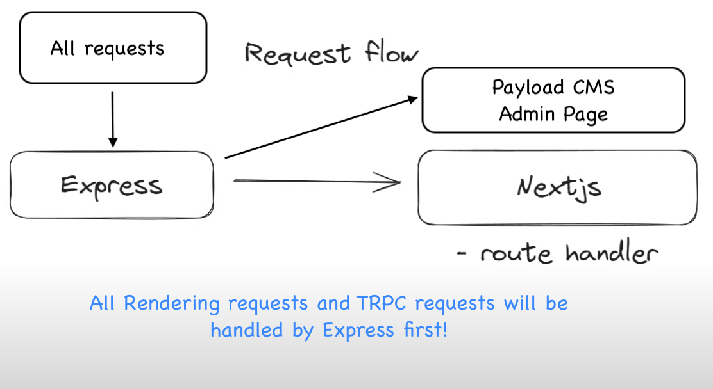
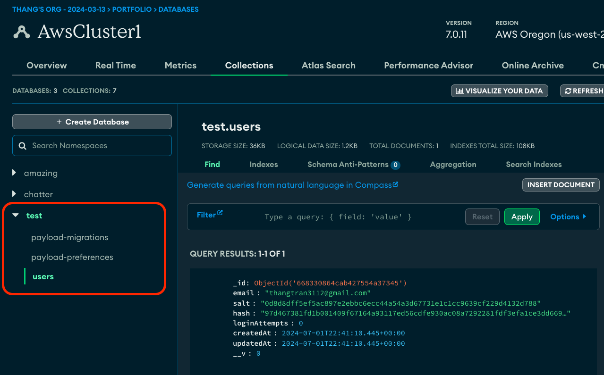
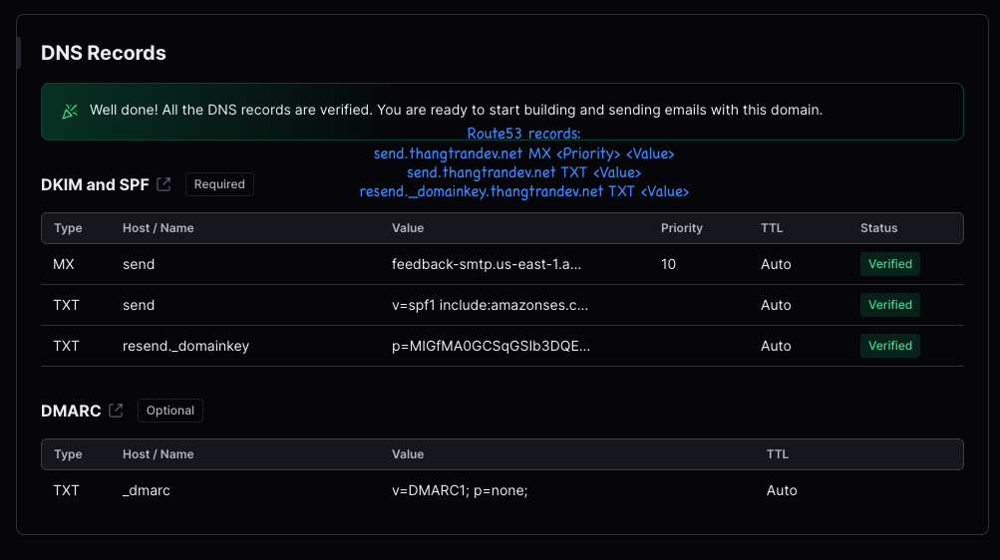
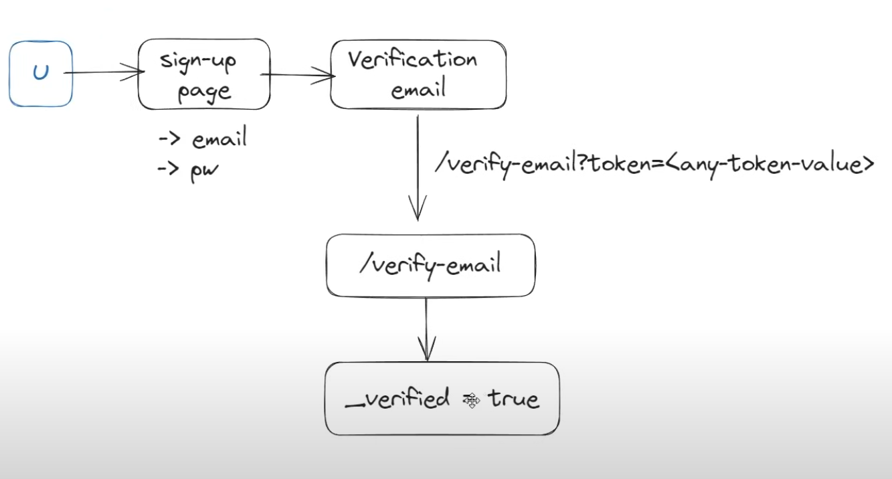
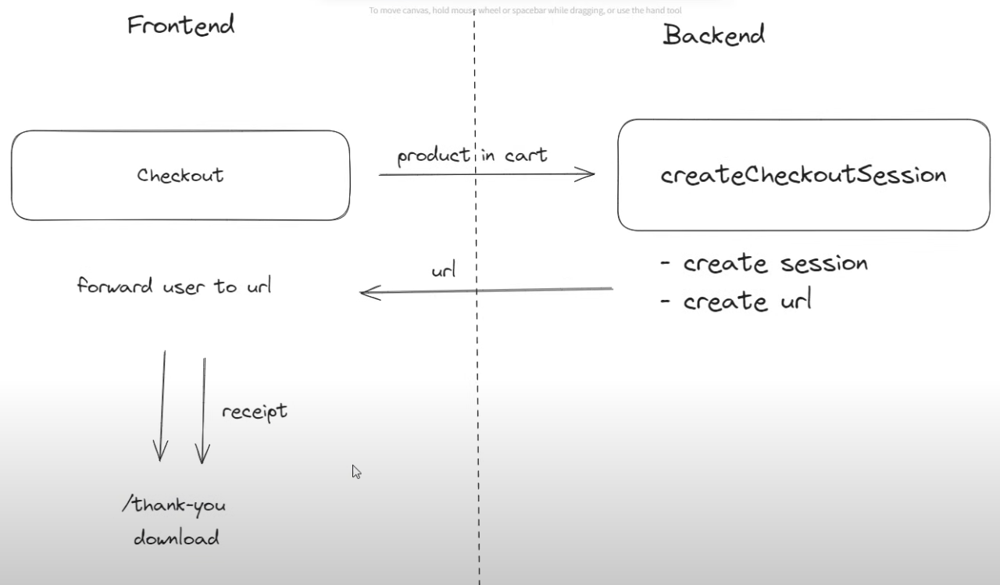
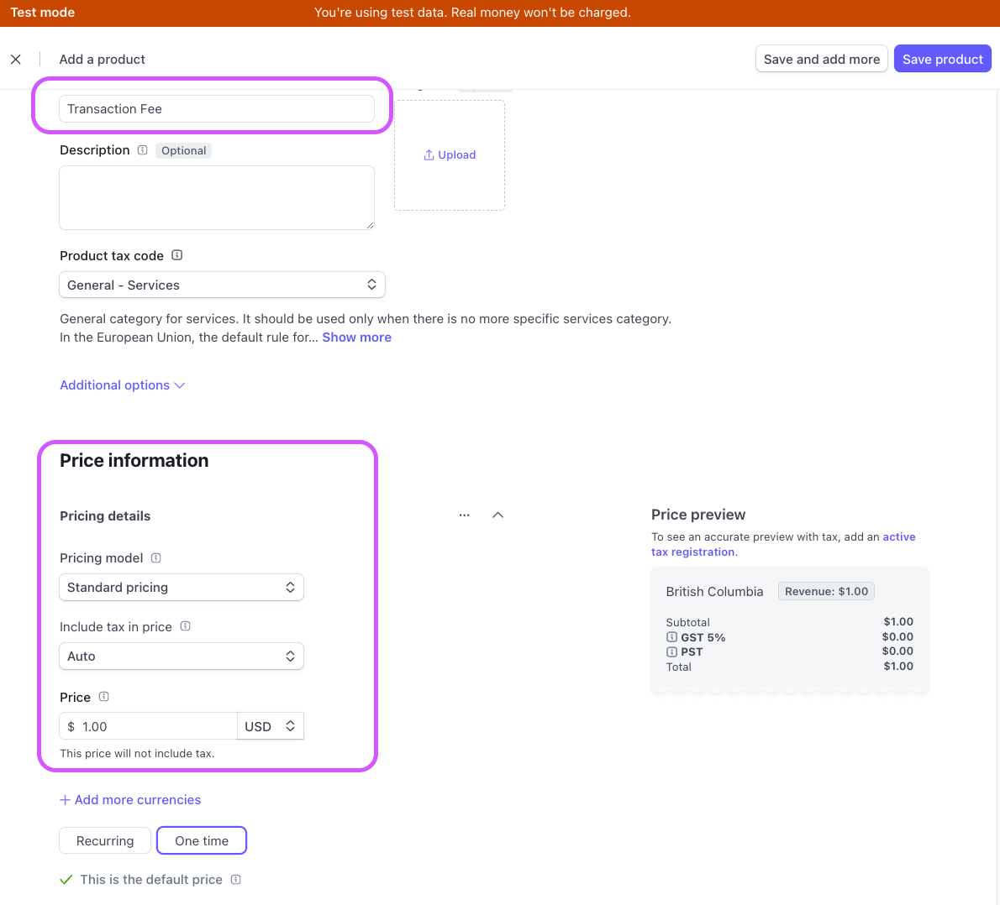
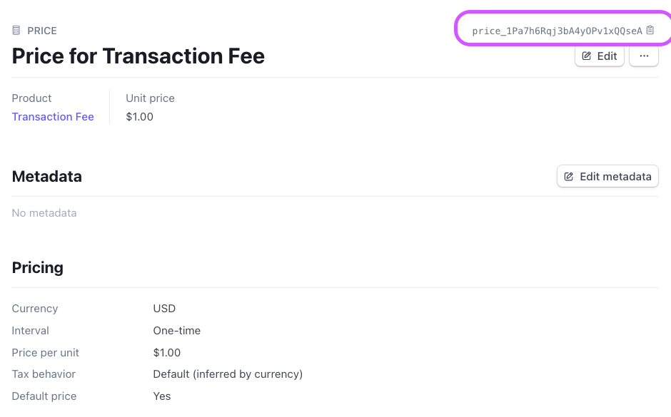
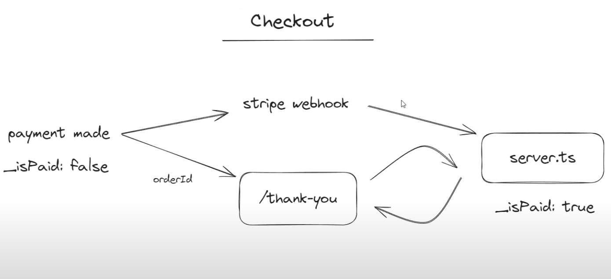

# Digital marketplace Techstacks:

- Fullstack approach, with combined BE and FE, with entry through ExpressJS
- Next14, Tailwind, [Shadcn UI](https://ui.shadcn.com/),[Lucide react](https://lucide.dev/icons/), [Zustand LocalStorage](https://docs.pmnd.rs/zustand/integrations/persisting-store-data)
- Backend: TRPC, Payload CMS, MongoDB

## Getting Started

- Install Shadcn UI with `npx shadcn-ui@latest init`
- Choose the [color theme](https://ui.shadcn.com/themes) that you want to use, and copy the theme to `src/app/globals.css`

## Express Middleware for NextJs

- We are using [Express as a middleware](https://medium.com/@obulareddyveera/next-js-invite-express-js-as-middleware-ea5e7bb494f0) for interacting with Payload.
- Using `cross-env` and `nodemon` in `dev` mode will automatically restart the express server on file changes.
- We also need to add a few custom decorators in `tsconfig.server.json` to make Express works:

```tsconfig.server.json
{
  "extends": "./tsconfig.json",
  "compilerOptions": {
    "module": "CommonJS",
    "outDir": "dist",
    "noEmit": false,
    "jsx": "react"
  },
  "include": ["src/server.ts", "src/payload.config.ts"]
}
```

- Express will be the first point-of-entry for both rendering and TRPC api requests.



## Payload Configuration (MongoDB, alternative: Postgres)

- Create `payload.config.ts` and export a default config.
- For `editor` in payload config, we can choose SlateJs[https://www.slatejs.org/] or Lexical[https://lexical.dev/].
- Install payload adapters for MongoDb (alternative: Postgres), and webpack bundler for our Express server:

```bash
npm i @payloadcms/richtext-slate @payloadcms/bundler-webpack @payloadcms
/db-mongodb --save
```

- For viewing payload Admin dashboard, please see `http://localhost:3000/sell`
- Important note: You should not have any `users` document in your database, in order to be redirected to `http://localhost:3000/sell/create-first-user`. [See more here](https://payloadcms.com/community-help/discord/i-cant-sign-up-as-admin)



## Zod Validation with react-hook-form

- [Use Zod validation schema for both client-side and server-side](./src/lib/validators/account-credentials-validator.ts)
- Integrate Zod validators with `@hookform/resolvers/zod`. [See here](<./src/app/(auth)/sign-up/page.tsx>)

## TRPC and tanstack/react-query

- Important: Whenever a new collection is created, make sure to add it in `payload.config.ts` and also run `npm run generate:types`
- Provides both FE and BE typesafe APIs with `@trpc/server` and `@trpc/client`. [See here](./src/trpc/index.ts)
- Create a Providers wrapper component, which will provide the `trpc` context to your app. [Providers](./src/components/Providers.tsx) and [Providers in layout.tsx](./src/app/layout.tsx)

```tsx
<trpc.Provider client={trpcClient} queryClient={queryClient}>
  <QueryClientProvider client={queryClient}>{children}</QueryClientProvider>
</trpc.Provider>
```

- At this point of time, TRPC v11 is still in beta, and TRPC v10 can only support tanstack/react-query v4.36.1. [See here](https://trpc.io/docs/migrate-from-v10-to-v11)

## MongoDB Collections

- For users collection, we have 3 types of users: `admin`, `buyer` and `seller`. [See here](./src/collections/users.ts)
- Plug the users collection in your payload config. [See here](./src/payload.config.ts)

## Email Signup Confirmation

- This project uses `resend` for email confirmation. [See resend SMTP docs](https://resend.com/changelog/smtp-service)
- Alternatives are AWS SES, Google Mail (500 emails limit), Mailchimp. Make sure to use the email providers, which our confirmation emails would not be landed in Spam folder.
- Note: we must add DNS records to prove our domain, so resend can work. [See here](https://resend.com/docs/adding-dns-records)
  
  

## Application Architecture

- 
- 

## Stripe Checkout

- Go to Stripe account, activate Test Mode, and select Developers tab.
- Use this credit card number for testing: 4242 4242 4242 4242. Other details can be anything.
- 
- 
- We will keep polling /thank-you page until order is set with `isPaid` = true.
- 

## Email templates

- [@react-email/components](https://www.npmjs.com/package/@react-email/components)
- [React Email templates](https://react.email/examples) with responsive design here.
- [Apple Email Receipt Example](https://demo.react.email/preview/receipts/apple-receipt)
- Using `@react-email/components`, we can render our email templates in React into a React component.

```tsx
export const ReceiptEmailHtml = (props: ReceiptEmailProps) =>
  render(<ReceiptEmail {...props} />, {
    pretty: true,
  });
```
